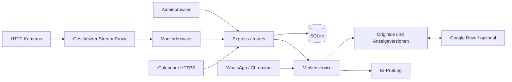

# Architektur und Wartung

Die Anwendung verwendet einen Node-Prozess mit Express und SQLite sowie Chromium für WhatsApp. Native ES-Module im Frontend brauchen keinen Build-Schritt. Fachlogik liegt in Services; HTTP-Routen prüfen Berechtigungen und rufen Services auf. Organisationsvorgaben sind zentral von der Logik getrennt.

| Datei / Verzeichnis                                                      | Verantwortung                                                                 |
| ------------------------------------------------------------------------ | ----------------------------------------------------------------------------- |
| `server/index.js`                                                        | Umgebung, HTTP-Start, geordnetes Beenden                                      |
| `server/app.js`                                                          | Services verbinden, Sicherheitsmiddleware und Routen registrieren             |
| `server/routes/`                                                         | Anmeldung, Organisation, Medien, Anzeige, Integrationen und WhatsApp getrennt |
| `server/organization.js`                                                 | Vorlagen, Validierung, öffentliche Darstellungseinstellungen                  |
| `server/store.js`                                                        | Schema, additive Migrationen und Datenzugriff                                 |
| `server/media.js`, `retention.js`                                        | Originale, Anzeigeversionen, Archivierung, Auswahlbegrenzung                  |
| `server/whatsapp.js`                                                     | Verbindung und WhatsApp-Ereignisse                                            |
| `server/import-message.js`, `image-review.js`                            | Importbestätigung, Sperrmitteilung und Freigabe                               |
| `server/whatsapp-compat.js`, `download-media.js`, `recover-messages.js`  | Abgegrenzte Anpassungen für WhatsApp-Web-Interna                              |
| `server/ai.js`, `drive.js`, `calendar.js`                                | Externe Dienste und Fehlerbehandlung                                          |
| `public/admin.js`                                                        | Start, Navigation, Sitzungswechsel und Polling                                |
| `public/organization-settings.js`, `ai-settings.js`, `drive-settings.js` | Getrennte Einstellungsformulare                                               |
| `public/notice-editor.js`, `notice-content.js`, `notice-layout.js`       | Rich-Text-Bearbeitung, Bereinigung und Einpassung                             |
| `public/display.js`, Playlistmodule                                      | Zeitsteuerung und Bildschirmaufteilung                                        |
| `public/appearance.js`                                                   | Gemeinsames Branding und Datumsdarstellung                                    |
| `public/styles.css`, `display.css`, `brand.css`                          | Adminbasis, Monitorbasis und Erscheinungsbild                                 |
| `tests/`                                                                 | Fachlogik, HTTP-Berechtigungen, externe Dienste mit Simulationen              |

## Kameras und Touch-Ansicht

Kameras besitzen einen eigenen Inhaltstyp `stream`. `server/streams.js` validiert Quellen, filtert öffentliche Metadaten und schreibt HLS-Listen um; `server/routes/streams.js` vermittelt authentifizierte Verbindungen und beendet diese bei Abbruch oder geänderten Berechtigungen. Streamdateien werden nicht im Medienarchiv gespeichert. `public/stream-player.js` verwaltet Wiedergabe und Verbindungsabbau, `touch-view.js` das temporäre Raster, `wall-layout.js` die Feldverteilung und `wall-settings.js` sowie `stream-editor.js` die zugehörigen Adminformulare.

## Medienfluss

1. Gruppenbild oder Upload validieren: maximal 12 MB und 40 Megapixel.
2. Original erhalten, JPEG-Anzeigeversion bis 2560 × 2560 Pixel erzeugen, EXIF-Ausrichtung berücksichtigen.
3. Metadaten und Empfangs-ID speichern; ein Replay erzeugt kein Duplikat.
4. Aktivierte KI hält das Bild bis zur Prüfung verborgen. Unsicherheit/Prüffehler sperren es. Eine manuelle Freigabe darf nicht von einem verspäteten Prüflauf aufgehoben werden.
5. 👍 bestätigt die Speicherung, unabhängig von der Sichtbarkeit.
6. Lebensdauer, Mindestbestand und Höchstzahl bestimmen die Anzeige. Inaktive Fotos bleiben gespeichert.
7. Löschen archiviert Dateien und Metadaten; Empfangs-IDs bleiben gegen Reimport erhalten.
8. Drive synchronisiert Original, Anzeigeversion und JSON in `active`, `inactive` oder `deleted`. Cache-Bereinigung erfolgt erst nach überprüfter Sicherung.

## Änderungen warten

- Neue Organisationsvorgaben in `organization.js` definieren und validieren, anschließend im Formular ergänzen. Nur unkritische Felder öffentlich freigeben.
- Unternehmensnamen, URLs und persönliche Inhalte ausschließlich in Vorlagen oder Laufzeitdaten ergänzen.
- Schema additiv migrieren; bestehende Inhalte und Empfangsbestätigungen erhalten. Inkompatible Migrationen und Wiederherstellung dokumentieren.
- Externe Dienste durch injizierbare Requests simulieren; Tests für Fehlerfälle und Rollen ergänzen.
- Rich-Text ausschließlich durch die bestehende Bereinigung ausgeben.
- Ein Prozess pro Datenverzeichnis und Chromium-Profil; keine parallelen Instanzen auf denselben Bestand.

## HTTP-API

JSON erwartet `Content-Type: application/json`, Uploads `multipart/form-data`. Fehler liefern `{ "error": "Beschreibung" }`. Admin- und Monitorrechte werden über HttpOnly-Cookies geprüft. Dies ist die interne Browser-API, keine versionierte Fremdschnittstelle.

| Endpunkte                                                                              | Zugriff / Zweck                                      |
| -------------------------------------------------------------------------------------- | ---------------------------------------------------- |
| `GET /healthz`, `/api/appearance`, `/branding/:file`                                   | Öffentlich: Prozess und Markenassets                 |
| `/api/session`, `/api/setup`, `/api/login`, `/api/logout`                              | Anmeldung / Einrichtung                              |
| `POST /api/password`                                                                   | Admin, andere Adminsitzungen widerrufen              |
| `GET /api/admin/state`; `PUT /api/settings`                                            | Admin: Bestand und Wiedergabe                        |
| `GET/PUT /api/organization`                                                            | Admin: Teiländerungen werden zusammengeführt         |
| `POST /api/organization/preset`                                                        | Admin: `preset` ist `neutral`                        |
| `POST /api/organization/images/:role`                                                  | Admin: Feld `image`, Rolle `logo`, `mark`, `favicon` |
| `POST /api/items/upload`, `/api/items/text`                                            | Admin: Foto / einzige Infotafel                      |
| `PATCH/DELETE /api/items/:id`                                                          | Admin: ändern / archivieren                          |
| `/api/display-link`, `/api/display-link/rotate`                                        | Admin: Monitor-Link / Widerruf                       |
| `POST /api/display/session`                                                            | Link-Token gegen Cookie tauschen                     |
| `GET /api/display/feed`, `/media/:file`                                                | Admin oder Monitor                                   |
| `/api/whatsapp/start`, `/stop`, `/reset`, `/group`, `/groups/refresh`, `/import/retry` | Admin: WhatsApp                                      |
| `GET/PUT /api/ai`; `POST /api/ai/review`                                               | Admin: KI                                            |
| `GET/PUT /api/drive`; `POST /api/drive/connect`, `/sync`, `/disconnect`                | Admin: Drive                                         |
| `GET /api/drive/callback`                                                              | Kurzlebiger OAuth-Nonce                              |

Adminpasswörter sind scrypt-Hashes, Sitzungstokens werden gehasht gespeichert. Adminsitzungen gelten zwölf Stunden, Monitorsitzungen bis zu 365 Tage; Linkrotation widerruft Monitorzugänge. Mutierende Anfragen prüfen Origin/Fetch-Site; Anmeldung ist begrenzt. Kamerapasswörter werden separat von der URL mit AES-256-GCM verschlüsselt; der Schlüssel liegt unter `data/camera-secrets.key`. Andere Integrationsgeheimnisse liegen im privaten Datenverzeichnis ohne zusätzliche Verschlüsselung durch die Anwendung. Dateisystem und Backups entsprechend schützen; der Kamera-Schlüssel muss beim Umzug erhalten bleiben.

## Aufbau des Adminbereichs

`public/admin.js` verbindet die Module und besitzt den aktuellen Server-Datenstand sowie die aktive Seite. Die Seiten importieren den Einstiegspunkt nicht zurück; damit entstehen keine zyklischen Abhängigkeiten.

| Modul in `public/admin/` | Aufgabe                                                                   |
| ------------------------ | ------------------------------------------------------------------------- |
| `api.js`                 | JSON-Anfragen und Rückmeldung bei abgelaufener Sitzung                    |
| `ui.js`                  | DOM-Helfer, Seitenüberschriften und Fehlermeldungen                       |
| `auth-page.js`           | Ersteinrichtung und Anmeldung                                             |
| `library-page.js`        | WhatsApp-Bilder, fixierte Inhalte, Suche, Filter und Kamera-Vorschauen    |
| `item-editor.js`         | Fotoeditor und Anbindung der Infotafel-/Streameditoren                    |
| `playback-page.js`       | Wiedergabe und Foto-Lebensdauer                                           |
| `settings-pages.js`      | Einbindung der bestehenden Integrationsformulare und Zugangseinstellungen |
| `monitor-page.js`        | Monitorvorschau und Monitor-Link                                          |
| `whatsapp-page.js`       | Verbindung, Gruppenauswahl, Import- und Bildtextregeln                    |

Die Factory-Funktionen erhalten nur ihre benötigten Datenzugriffe und Aktionen. `getData()` liest den jeweils aktuellen Stand, auch nach einer asynchronen Aktualisierung. `refresh()` lädt Serverdaten; `render()` zeichnet die aktive Seite neu. `navigate()` gehört allein dem Einstiegspunkt. Der lokale Suchzustand und die Freigabefunktionen für Kamera-Vorschauen bleiben in der Medienseite. Beim Verlassen der fixierten Inhalte oder der Sitzung werden Vorschauen freigegeben.

Der Fotoeditor enthält keine alte Markdown-Infotafelmaske mehr: Infotafeln gehen direkt an den bestehenden Rich-Text-Editor.

## HTML-Templates und DOM

Das Seiten-Markup liegt in `public/templates/*.html` als native `<template>`-Elemente. Die Dateinamen entsprechen den zugehörigen JavaScript-Modulen: beispielsweise `admin-whatsapp-page.html` zu `admin/whatsapp-page.js` und `notice-editor.html` zu `notice-editor.js`.

`public/templates.js` lädt die Dateien einmal beim Start, prüft eindeutige Template-IDs und klont deren Inhalte. Es gibt keine Auswertung von JavaScript in HTML und keine eigene Template-Sprache. Die Platzhalter `data-*` sind normale DOM-Selektoren. Dynamische Texte werden mit `textContent`, Formulare mit `value` und `checked` gesetzt. Optionen entstehen über `Option`, Listen über geklonte DOM-Knoten. Nutzerdaten werden nicht als HTML zusammengebaut.

Die gezielten Ausnahmen sind bereinigter Rich-Text aus `notice-content.js` und die statischen SVG-Icons in `icons.js`. Beide haben einen klar abgegrenzten Ausgabepfad. `admin/media-card.js` erstellt Bildkarten samt Metadaten; `library-page.js` verwaltet deren Aktionen und Vorschauverbindungen.

### Eine Ansicht ändern

1. Struktur, Beschriftungen und Formulargrenzen in der passenden HTML-Datei ändern.
2. Datenzuweisung und Ereignisse im gleichnamigen JavaScript-Modul anpassen. Neue Template-Dateien in der Dateiliste von `templates.js` ergänzen.
3. Darstellung in der zuständigen CSS-Datei anpassen.
4. `npm run check`, `npm test` und `npm run test:browser` ausführen. Der Browser-Test verwendet eine temporäre Installation.

## Aufbau der Monitoranzeige

| Modul                             | Verantwortung                                                                 |
| --------------------------------- | ----------------------------------------------------------------------------- |
| `display.js`                      | Monitorzugang, Feed-Aktualisierung und Ablauf der Wiedergabe                  |
| `display/wall-controller.js`      | Rasterfelder und Freigabe genau eines Bildwechsels gleichzeitig               |
| `display/notice-panel.js`         | Infotafel, Kalender und Position des Infofelds                                |
| `display/photo-layout.js`         | Bildladen, gemeinsame Bildtextauswahl, Einpassung und intelligenter Zuschnitt |
| `display/slides.js`               | Aufbau der Foto-/Streamansicht und Freigabe ihrer Streamressourcen            |
| `player-core.js`                  | Auswahl der nächsten Inhalte und Anzeigedauer                                 |
| `touch-view.js`, `stream-pool.js` | Temporäre Touch-Ansicht und wiederverwendete Kameraverbindungen               |

Die alte Text-Slideshow ist entfernt: Die einzige Infotafel wird ausschließlich im Infofeld gerendert. Der Monitor-Browsertest prüft mehrere tatsächliche Bildwechsel auf Überschneidungen sowie die automatische Rückkehr aus dem Touch-Modus.
